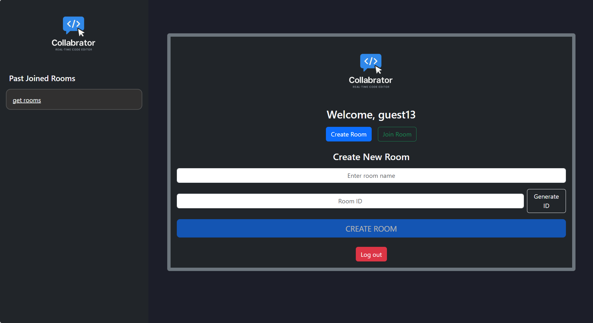
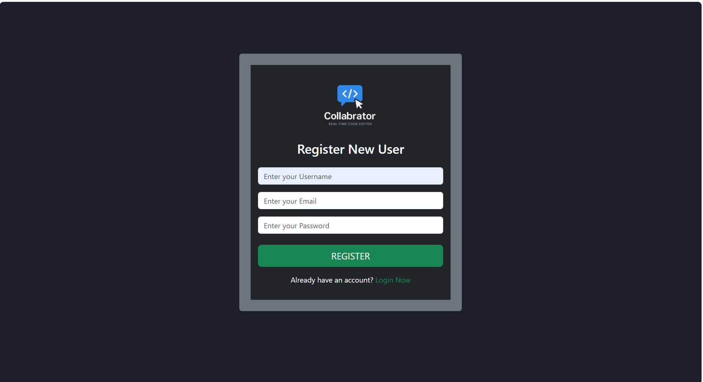
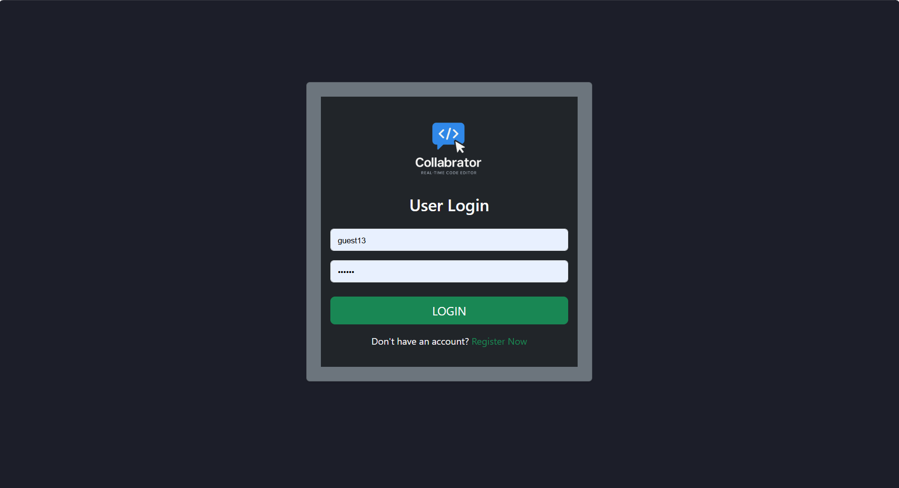
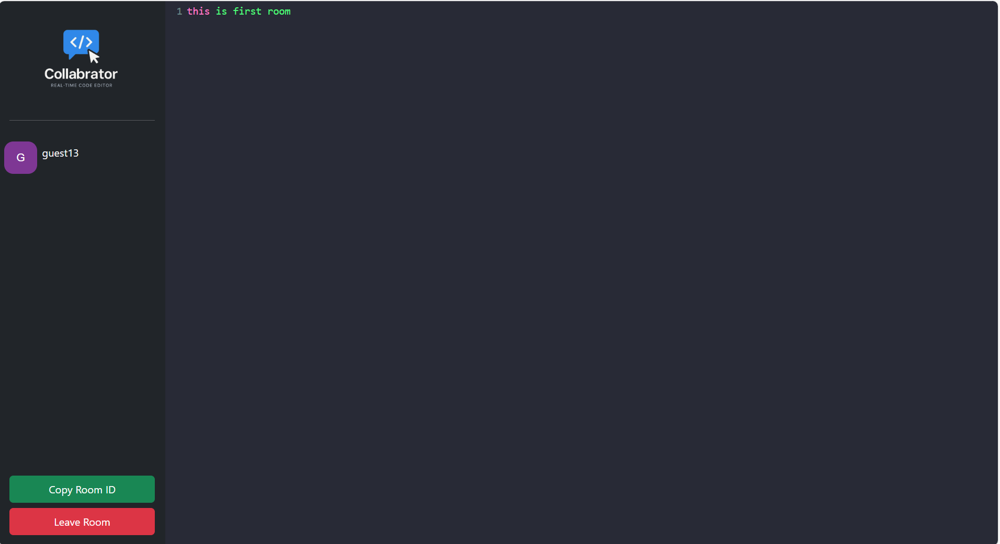

# 💻 Real-Time Collaborative Code Editor

A full-stack real-time collaborative code editor that allows multiple users to edit and share code in real time, with authentication and persistent storage using MongoDB.

---

## PROJECT DEMO - 

### 📽️ Demo Video

[Click here to watch the demo](./real-time-code-editor-demo.webm)

## Preview - 

### Home Page -


### Register Page - 



### Login Page -



### Room Page - 




## LIVE URL - 
### BACKEND LIVE URL - 
    https://live-doc-code-editor.onrender.com

### FRONTEND LIVE URL - 
    https://live-code-doc-editor.netlify.app/

## 📚 Table of Contents

- [📝 Features](#-features)
- [📁 Folder Structure](#-folder-structure)
- [🚀 Getting Started](#-getting-started)
  - [Backend Setup](#backend-setup)
  - [Frontend Setup](#frontend-setup)
- [🔐 Authentication](#-authentication)
- [🧠 Database Design](#-database-design)
- [🌐 API Endpoints](#-api-endpoints)
- [🧪 Technologies Used](#-technologies-used)
- [🛠️ Future Enhancements](#️-future-enhancements)
- [📄 License](#-license)

---

## 📝 Features

- 🔒 JWT-based authentication system
- 📄 Real-time collaborative code editing with socket integration (coming soon)
- 🧑‍🤝‍🧑 Room-based document management
- 💾 Persistent data using MongoDB
- 🧰 Secure password hashing with bcrypt
- 🧪 Modular and scalable architecture
- ⚛️ Clean and modern frontend with React

---

## 📁 Folder Structure

    project-root/
    ├── backend/
    │ ├── models/
    │ ├── routes/
    │ ├── middleware/
    │ ├── config/
    │ ├── .env
    │ └── server.js
    │
    ├── frontend/
    │ ├── src/
    │ │ ├── components/
    │ │ ├── pages/
    │ │ ├── utils/
    │ │ └── App.js
    │ ├── public/
    │ ├── .env
    │ └── package.json
    └── README.md


---

## 🚀 Getting Started

### 🖥 Backend Setup
- - - 
1. Navigate to the backend directory:

   ```bash
   cd backend
2. Install dependencies:
    npm install
3. Add a .env file:
    PORT=5000
    JWT_SECRET=your_jwt_secret_key
4. Start the server:
    npm start

Backend runs on: http://localhost:5000
- - - 
### 🌐 Frontend Setup
1. Navigate to the frontend directory:
    cd frontend
2. Install dependencies:
    npm install

3. Create .env file:
    REACT_APP_API_URL=http://localhost:5000

4. Run the frontend:
    npm start

Frontend runs on: http://localhost:3000


- - - 

## 🔐 Authentication

- User can register/login via email or username.

- JWT token is stored in httpOnly cookie or in headers.

- Protected routes use authMiddleware for access control.

- - - 


## 🧠 Database Design (MongoDB Atlas)

### 🧑‍💼 User
| Field    | Type   | Description      |
| -------- | ------ | ---------------- |
| username | String | Unique user name |
| email    | String | User's email ID  |
| password | String | Hashed password  |


- - - 
### 🏠 Room
| Field        | Type              | Description            |
| ------------ | ----------------- | ---------------------- |
| name         | String            | Name of the room       |
| roomId       | String (UUID)     | Unique room identifier |
| createdBy    | ObjectId → User   | Room creator           |
| participants | \[user, joinedAt] | Users in the room      |

- - - 


### 📄 Document
| Field        | Type            | Description                    |
| ------------ | --------------- | ------------------------------ |
| roomId       | String          | Room to which document belongs |
| content      | String          | The actual code/content        |
| createdBy    | ObjectId → User | Initial creator                |
| lastEditedBy | ObjectId → User | Last user who edited           |


- - - 
## 🌐 API Endpoints

### Auth Routes (/api/auth)
- POST /register – Create a new user

- POST /login – Authenticate user

- - - 

### Room Routes (/api/rooms)
- POST /create – Create a new room

- GET /:roomId – Get room details


-  - - 


### Document Routes (/api/documents)
- POST /save – Save document changes

- GET /:roomId – Load document by room

 - - - 

## 🧪 Technologies Used
### 🖥 Frontend:
- React.js

- React Router

- Axios

- Tailwind CSS (or other styling)

- Socket.IO (for future real-time features)


- - - 
### 🌐 Backend:
- Node.js

- Express.js

- MongoDB + Mongoose

- JWT for authentication

- bcrypt for hashing


 -- - - 


## 🛠️ Future Enhancements
- ✅ Add real-time collaboration via Socket.IO

- ✅ Role-based access (Owner, Editor, Viewer)

- 🧾 Document versioning

- 📊 Usage analytics

- 🌐 Deployment with Vercel + Render or Railway

- - - - 


## 📄 License
This project is licensed under the MIT License – feel free to fork and enhance!

- - - -

## 👩‍💻 Author
Tanvi Tomar
Final Year B.Tech (IoT) | Data Science Intern | MERN Developer
LinkedIn | GitHub | Portfolio

- - - -- - - -
